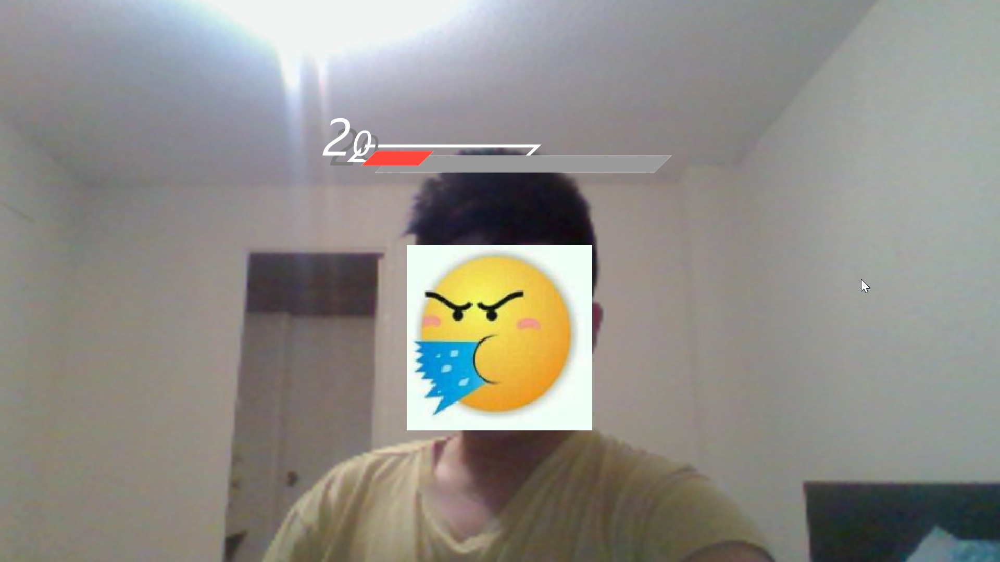

# Try Not To Laugh
“Try Not to Laugh” is a project which uses audience’s emotion as input to explore the role of computer among complex human emotion. In a way that enhances the bonds between both human-to-computer and human-to-human.  
Users take damage when they laugh

Demo:
-----
  - Youtube Link: https://www.youtube.com/watch?v=WJTW2zH-cSc
  
Screenshots:
-------------

Install:
---------
 - Package required (use under license): https://github.com/AdoHaha/EmotionProcessing
 - Download everything and run with Processing 3.3
  
Note:
-----
 N/A

Credits: 
--------
  - https://github.com/AdoHaha/EmotionProcessing
  - Yuky, Kevin for demoing
  
Contact: 
--------
- Any bug reports or concerns please contact jimmyshanofficial@gmail.com 
- Website: http://jimmyshan.com
