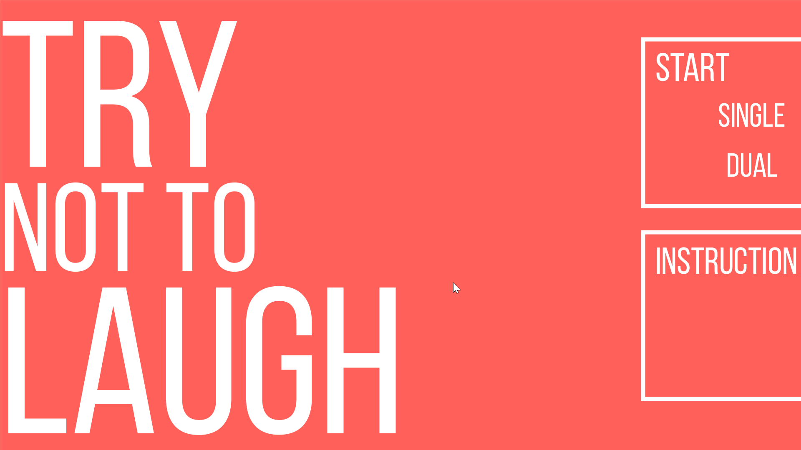
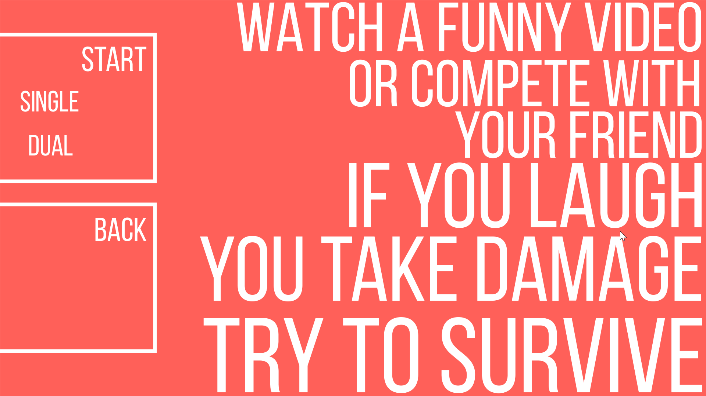

# Try Not To Laugh
“Try Not to Laugh” is a project which uses audience’s emotion as input to explore the role of computer among complex human emotion. In a way that enhances the bonds between both human-to-computer and human-to-human.  
Users take damage when they laugh

Screenshots:
-------------

Install:
---------
  To experience, please download application.windows32 and run emotion2.exe

Demo:
-----
  Youtube Link: https://www.youtube.com/watch?v=WJTW2zH-cSc
  
Note:
-----
 N/A

Credits: 
--------
Yuky, Kevin for demoing
  
Contact: 
--------
Any bug reports or concerns please contact jimmyshanofficial@gmail.com 
